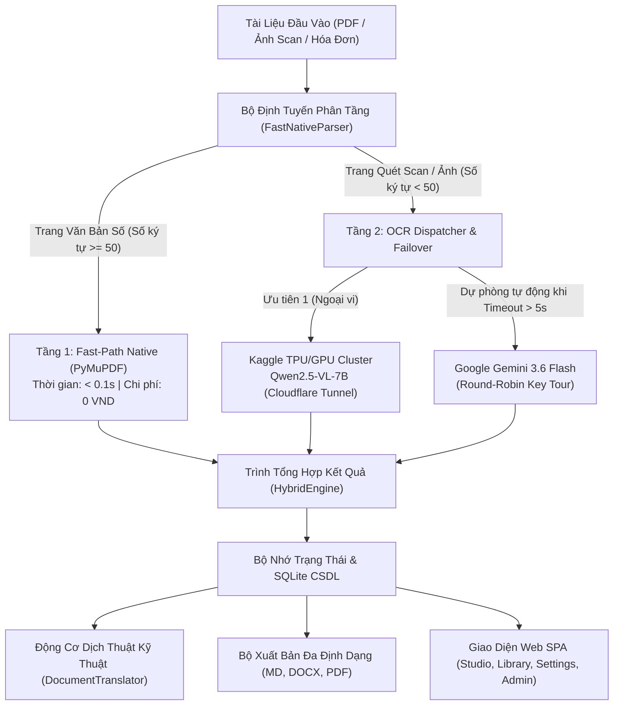

# Serverless Hybrid Document OCR, Parsing & Technical Translation Platform

Nền tảng bóc tách tài liệu số, nhận diện ký tự quang học (OCR) đa phương thức và dịch thuật tài liệu kỹ thuật chuẩn doanh nghiệp. Hệ thống được tối ưu hóa chi phí vận hành với kiến trúc phân tầng thông minh (Fast-Path Native kết hợp Vision LLMs), hỗ trợ quản lý tour xoay vòng API Keys, giao diện ứng dụng đơn trang (SPA) mượt mà và xuất bản đa định dạng (Markdown, Word .docx, PDF chuẩn in ấn A4).

---

## 1. Sơ Đồ Kiến Trúc Hệ Thống



---

## 2. Các Tính Năng Nổi Bật

### 2.1. Động Cơ Xử Lý Văn Bản Đa Tầng (Multi-Tier Parsing Engine)
- **Tầng 1 - Fast-Path Native (PyMuPDF)**: Bóc tách trực tiếp luồng văn bản số của tệp PDF với tốc độ mili-giây, bảo toàn 100% các bảng biểu có cấu trúc và không phát sinh chi phí tính toán AI.
- **Tầng 2 - Vision Multi-modal OCR**: Tự động nhận diện các trang tài liệu scan hoặc ảnh chụp, trích xuất cấu trúc bảng phức tạp thành Markdown chuẩn mực.
- **Cơ Chế Chuyển Đổi Dự Phòng Tức Thì (Self-Healing Failover)**: Khi endpoint Kaggle ngoại vi phản hồi chậm quá 5 giây hoặc mất kết nối, hệ thống tự động chuyển tiếp liền mạch sang cụm Google Gemini 3.6 Flash mà không làm gián đoạn tiến trình của người dùng.

### 2.2. Dịch Thuật Kỹ Thuật & Bảo Toàn Định Dạng
- Module dịch thuật `DocumentTranslator` chuyển đổi nội dung tài liệu sang đa ngôn ngữ (Tiếng Anh, Tiếng Nhật, Tiếng Hàn, Tiếng Trung, Tiếng Pháp, Tiếng Đức, Tiếng Việt).
- Cơ chế tự động phân trang thông minh khi dịch tài liệu lớn, đảm bảo không vượt quá giới hạn token và giữ nguyên 100% cấu trúc Markdown (bảng biểu, tiêu đề, mã nguồn).

### 2.3. Xuất Bản Đa Định Dạng (Multi-Format Exporters)
- **Markdown (.md)**: Xuất văn bản thuần có cấu trúc tiêu chuẩn.
- **Microsoft Word (.docx)**: Chuyển đổi định dạng bảng chuyên nghiệp, căn lề và định kiểu tiêu đề tự động bằng `python-docx`.
- **In ấn PDF (.pdf)**: Tạo tệp PDF chuẩn trang in A4 thông qua bộ phân tích `markdown` và engine kết xuất `PyMuPDF Story`.

### 2.4. Trải Nghiệm Giao Diện Người Dùng Không Giật Lag (Zero-Flicker SPA)
- Điều hướng phía máy khách (`spa_router.js`) loại bỏ hoàn toàn việc tải lại toàn bộ trang khi chuyển đổi giữa các màn hình Studio, Kho tài liệu, Cài đặt và Quản trị.
- Bảo toàn trạng thái làm việc hai lớp (Dual-Layer State Persistence) trên cả máy chủ (Flask Session + SQLite) và bộ nhớ đệm trình duyệt (localStorage), tránh mất dữ liệu khi làm mới trang.

### 2.5. Bảng Điều Khiển Quản Trị & Tour Xoay Vòng API Key
- Hệ thống điều phối xoay vòng khóa API (Round-Robin Tour Manager) phân bổ hạn ngạch đồng đều giữa các nhà cung cấp (Google Gemini, Kaggle, Groq).
- Giao diện Quản trị viên (`/admin`) cho phép giám sát chỉ số KPI, xem nhật ký xử lý, thêm mới, bật/tắt tạm dừng hoặc xóa khóa API trực tiếp.

---

## 3. Cấu Trúc Thư Mục Dự Án

```text
aws/
├── README.md                           # Tài liệu tổng quan dự án và hướng dẫn vận hành
├── requirements.txt                    # Danh mục thư viện Python phụ thuộc
├── .env.example                        # Mẫu thiết lập biến môi trường
├── .gitignore                          # Cấu hình bỏ qua tệp nhạy cảm và tệp sinh tự động
├── docs/                               # Tài liệu thiết kế và lộ trình đào tạo
│   ├── 01_aws_cloud_journey_curriculum.md
│   ├── 02_internship_roadmap.md
│   ├── 03_hands_on_checklist.md
│   ├── 04_project_agentic_rag_spec.md
│   ├── 04_project_hybrid_ocr_spec.md
│   └── reports/                        # Báo cáo kỹ thuật và hồ sơ điều tra sự cố
│       ├── incident-investigation-report.md
│       └── incident-report-day03.md
├── src/                                # Mã nguồn toàn bộ ứng dụng
│   ├── backend/                        # Tầng xử lý nghiệp vụ và lưu trữ
│   │   ├── app.py                      # Lambda handler và router backend
│   │   ├── auth/                       # Module xác thực và kiểm soát quyền truy cập
│   │   ├── config/                     # Quản lý cấu hình (AppSettings, SSM Parameter)
│   │   ├── database/                   # SQLite database driver và lược đồ CSDL
│   │   ├── exporters/                  # Bộ xuất file Markdown, Word (.docx) và PDF
│   │   ├── llm/                        # Module điều phối key tour và dịch thuật Gemini
│   │   └── parsers/                    # Động cơ Fast-Path và điều phối OCR Hybrid
│   ├── frontend/                       # Máy chủ giao diện web Flask và ứng dụng SPA
│   │   ├── blueprints/                 # Các router phân hệ (Studio, Library, Settings, Admin)
│   │   ├── server.py                   # Điểm khởi chạy máy chủ web Flask
│   │   ├── static/                     # Tài nguyên tĩnh (CSS, Icons SVG 2D, Kịch bản JS)
│   │   └── templates/                  # Giao diện HTML đa trang (Jinja2)
│   └── kaggle/                         # Mã nguồn phục vụ mô hình Qwen2.5-VL trên Kaggle
│       ├── serve_ocr.py                # Máy chủ FastAPI + Cloudflare Tunnel
│       ├── monitor_server.py           # Công cụ giám sát và bắt endpoint tự động
│       └── qwen_ocr_server.ipynb       # Jupyter Notebook huấn luyện và triển khai
├── data/                               # Dữ liệu tài liệu mẫu phục vụ kiểm thử
│   └── sample_documents/
├── wiki/                               # Kho lưu trữ tri thức bổ trợ
└── tests/                              # Bộ kiểm thử tự động toàn diện (27 bài kiểm thử)
```

---

## 4. Hướng Dẫn Khởi Chạy Nhanh (Quick Start)

### 4.1. Yêu Cầu Môi Trường
- Python 3.10 hoặc mới hơn.
- Trình quản lý gói `pip`.

### 4.2. Cài Đặt Thư Viện Phụ Thuộc
Cài đặt toàn bộ các gói thư viện cần thiết từ thư mục gốc của dự án:
```bash
pip install -r requirements.txt
```

### 4.3. Thiết Lập Biến Môi Trường
Sao chép tệp mẫu cấu hình và điều chỉnh các giá trị phù hợp:
```bash
cp .env.example .env
```
Các thông số cấu hình cốt lõi trong `.env`:
- `SECRET_KEY`: Khóa bảo mật phiên làm việc người dùng.
- `OCR_MODE`: `HYBRID_KAGGLE` (mặc định), `STANDALONE` hoặc `LOCAL_MOCK`.
- `GEMINI_API_KEY`: Khóa API Google Gemini phục vụ dịch thuật và dự phòng OCR.
- `KAGGLE_ENDPOINT`: Đường dẫn Cloudflare Tunnel trỏ đến máy chủ Qwen2.5-VL.

### 4.4. Khởi Chạy Máy Chủ Ứng Dụng
Chạy máy chủ Flask phục vụ giao diện người dùng và các API nghiệp vụ:
```bash
python3 src/frontend/server.py
```
Sau khi khởi động, ứng dụng sẽ hoạt động tại địa chỉ:
```text
http://localhost:5000
```

### 4.5. Tài Khoản Đăng Nhập Mặc Định
Cơ sở dữ liệu SQLite được tự động khởi tạo khi chạy lần đầu với các tài khoản được định sẵn:
- **Tài khoản Quản trị viên (Admin)**:
  - Tên đăng nhập: `admin`
  - Mật khẩu: `Admin@123`
  - Quyền hạn: Toàn quyền truy cập bảng điều khiển quản trị, quản lý API Keys và tài khoản.
- **Tài khoản Người dùng chuẩn (User)**:
  - Tên đăng nhập: `demo`
  - Mật khẩu: `Demo@123`
  - Quyền hạn: Bóc tách tài liệu tại Studio, lưu trữ và dịch thuật tài liệu cá nhân.

---

## 5. Kiểm Thử Tự Động (Automated Testing)

Dự án đi kèm bộ kiểm thử tự động toàn diện gồm **27 bài kiểm thử** bao phủ toàn bộ các tầng nghiệp vụ:
- Kiểm thử cấu hình hệ thống và nạp biến môi trường.
- Kiểm thử cơ sở dữ liệu SQLite, phân quyền xác thực và cách ly dữ liệu người dùng.
- Kiểm thử động cơ phân tích cú pháp Fast-Path Parser và phát hiện bảng biểu thực tế.
- Kiểm thử xuất bản tệp Markdown, Word (.docx) và PDF.
- Kiểm thử các điểm cuối API cá nhân hóa (Settings) và bảng điều khiển quản trị (Admin).

Để thực thi toàn bộ bộ kiểm thử, chạy lệnh sau tại thư mục gốc:
```bash
PYTHONPATH=. pytest -v
```

Kiểm tra tính hợp lệ của toàn bộ kịch bản JavaScript phía máy khách:
```bash
for f in src/frontend/static/js/*.js; do node -c "$f"; done
```

---

## 6. Giấy Phép & Đóng Góp

Dự án được xây dựng và phát triển phục vụ lộ trình thực tập Cloud/AWS, hoàn thiện các tiêu chuẩn kỹ thuật doanh nghiệp của chương trình FCJ Workforce Program.
